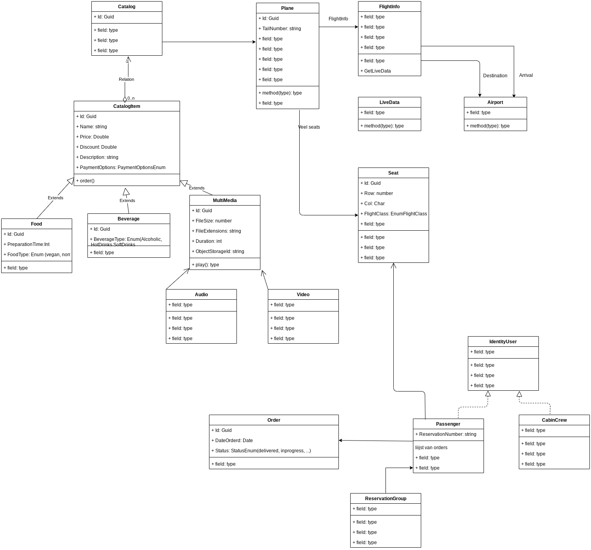

# Native Apps II In-flight system project

## Inleiding

Voor het vak "Native Apps II" werd een In-flight Entertainment System ontworpen en ontwikkeld. De client side applicatie werd als een UWP geïmplementeerd, voor de backend werd gebruik gemaakt van .NET Core.

## Auteurs

* Guust Ysebie
* Milad Nazari
* Vincent Vandewyer

Groep: GENT__J9

## Installatie en gebruik

### Prerequisites

* .Net Core 3.1 SDK
* MySQL of SQL Server
* Visual Studio 2017 of nieuwer

### Installatie 

1. Clone het project 
2. Start de backend (correcte database connection string gebruiken)
3. Start de front end
4. Gebruik de volgende demo-credentials:

    - Crew member: gebuikersnaam: `CrewMem1`, wachtwoord: `Test123!`
    - Passagier: code: `resvcode13B`

## Klassendiagram

[Link naar draw.io bestand](https://drive.google.com/file/d/1vP131m-CmmDpCKtScZqnLEjhiIs_tPDR/view?usp=sharing)

## Functionaliteiten

### Rol passagiers

- Ingelogd op basis van zetelnummer. Elke passagier krijgt initieel een zitplaats toegewezen maar het cabinepersoneel moet passagiers wel kunnen verhuizen van zetel!

- Device: monitor in de zeter

- Passagiers  kunnen  de  app  gebruiken om:

    - vluchtinformatie te bekijken (ETA, origine, bestemming, etc.)
    
    - Via de catalogus in de app een snack te bestellen. Deze bestellingen worden geregistreerd. De passagier kan ook steeds zijn bestelgeschiedenis raadplegen (en evt. exporteren naar pdf)  
    
    - Een  film  of  serie  te  bekijken. Dit mogen uiteraard dummy bestanden zijn. Zelfs muziek (mp3) beluisteren is mogelijk.
    
    - Het weer te raadplegen. Dit dient de echte huidige weersvoorspelling van de bestemming te zijn (externe API). 
    
    - Met hun reisgezelschap te chatten. Deze relatie moet in de app ook  zichtbaar  zijn. Rol cabinepersoneel (tablet)

### Rol cabinepersoneel

- Device: tablet

- Cabinepersoneel kan de app gebruiken om:

    - Passagiers van  stoel  te wisselen. Het cabinepersoneel kan ook een overzicht zien van de bestellingen die werden geplaatst, en kan deze markeren als “afgehandeld”.
    
    - Custom meldingen te sturen naar de passagiers: bvb “Veiligheidsriemen vast aub”. Dit kan ofwel naar alle passagiers, of naar één specifieke passagier.
    
    - Naar passagiers adverteren: de chocoladerepen staan in promotie, bijvoorbeeld. De passagiers krijgen dit dan op gepaste wijze te zien.

## Design

- Gebruik van een aantal features uit het Fluent Design System

- Van de app wordt verwacht zowel op mobile als op desktop gebruiksvriendelijk te zijn. Zorg dus voor beide doeleinden een gepaste UX

## Technisch

### Clients

Meerdere devices moeten ondersteund worden: de device desktop (laptop) is verplicht. Maar de app zal ook op tablets gebruikt worden dus zorg voor responsiveness.

De app moet worden geschreven in XAML en de code-behind in C# volgens het Universal Windows Platform (UWP). De data in de app is uiteraard live data die moet kunnen worden aangepast via de app! Het is dus niet toegelaten om alles hard te coderen. Deze data wordt aangeleverd door de back-end. De app communiceert met de back-end via REST API calls (GET, POST, PUT, DELETE).

### Backend

De  back-end  zal  een  REST  Service  (WEB  API). De enige technische vereiste van de werkende REST Service is, geschreven zijn in ASP.NET (Core) gebruikmakend van Entity Framework

